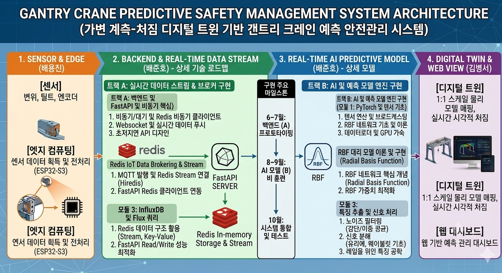

# 🏗️ 가변 계측-처짐 디지털 트윈 기반 갠트리 크레인 예측 안전관리 시스템

## 📖 프로젝트 소개
본 프로젝트는 갠트리 크레인의 상태(변위, 틸트 등)를 실시간으로 계측하고, AI 예측 모델을 통해 크레인의 처짐과 위험 상태를 사전에 감지하는 **디지털 트윈 기반의 안전관리 시스템**을 구축하는 것을 목표로 합니다. 실시간 데이터 파이프라인과 PyTorch 기반 RBF(Radial Basis Function) 대리 모델을 결합하여 초저지연 모니터링 환경을 제공합니다.

## 👥 팀원 및 담당 역할
*   **배용진:** SENSOR & EDGE (엣지 컴퓨팅 및 센서 데이터 획득/전처리)
*   **배준호:** BACKEND & REAL-TIME DATA STREAM / AI PREDICTIVE MODEL (비동기 백엔드, 데이터 스트림 구축 및 PyTorch RBF 예측 모델 엔진 구현)
*   **김병서:** DIGITAL TWIN & WEB VIEW (1:1 스케일 물리 모델 매핑 및 웹 기반 실시간 시각적 처짐 대시보드 구축)

## 🛠️ 사용 하드웨어 및 기술 스택
*   **하드웨어 (Edge):** ESP32-S3-WROOM-1 듀얼 코어 보드, MPU-6050(6축 자이로/가속도), ADXL345(가속도), HC-SR04(초음파 거리), SW-420(진동), ACS712(전류).
*   **백엔드 & 스트림:** Python, FastAPI, Redis (향후), InfluxDB (시계열 데이터 저장), Websocket, pyserial (프로토타입용).
*   **AI 모델:** PyTorch, RBF(Radial Basis Function) 기반 대리 모델.
*   **프론트엔드:** HTML/Vanilla JS, Tailwind CSS (실시간 대시보드 프로토타입). *(대화 기록 참고)*

## 🚀 시스템 아키텍처 및 개발 로드맵
프로젝트는 총 4개의 Phase로 나뉘어 진행되며, 현재 초기 하드웨어 검증을 위한 **시리얼 직결 프로토타입 단계**를 완료하고 정규 아키텍처로의 전환 및 AI 연동을 앞두고 있습니다.

### 📌 Phase 1: Sensor & Edge (진행 완료)
*   ESP32-S3 보드와 ADXL345, HC-SR04 센서를 브레드보드에 핀 매핑하여 결선 완료.
*   C++ 펌웨어를 통해 1초 주기로 센서 데이터를 읽고, 백엔드 파싱이 용이한 단일 문자열 포맷(`AX,AY,AZ,DIST`)으로 시리얼 출력하는 기능 구현.

### 📌 Phase 2: Backend & Real-Time Data Stream (프로토타입 완료, 고도화 예정)
*   **현재 (프로토타입):** 무선망 구축으로 인한 지연을 생략하기 위해, 호스트(맥북)와 ESP32를 C-to-C 케이블로 직결하여 Python(`pyserial`) 백엔드에서 실시간 데이터를 수신합니다. 수신된 데이터는 FastAPI 서버를 통해 비동기 큐(Queue)로 처리되어 WebSocket으로 클라이언트에 푸시됩니다.
*   **향후 (정규 아키텍처):** ESP32에서 MQTT 통신으로 데이터를 발행하고, 초고속 인메모리 저장소인 Redis IoT 브로커가 이를 수신하여 FastAPI 및 InfluxDB로 전송하는 산업용 무선 파이프라인으로 전환할 예정입니다.

### 📌 Phase 3: Real-Time AI Predictive Model (진행 예정)
*   수집된 실물 크레인 센서 데이터와 3D 구조 해석(FEM) 시뮬레이션 기반의 가상 위험 데이터를 융합하여 데이터셋을 구축합니다. *(대화 기록 참고)*
*   PyTorch를 활용하여 RBF(Radial Basis Function) 대리 모델 엔진을 구현 및 학습시킵니다.
*   노이즈 필터링 및 레일 특징 공학(Feature Engineering)을 거쳐 실시간 크레인 처짐량을 예측합니다.

### 📌 Phase 4: Digital Twin & Web View (진행 중)
*   FastAPI의 WebSocket과 연동하여 센서 값이 수신될 때마다 카드가 깜빡이는 **실시간 웹 대시보드 프로토타입** 구축을 완료했습니다. *(대화 기록 참고)*
*   향후 1:1 스케일 물리 모델을 웹 상에 매핑하여, AI가 예측한 처짐량을 시각적 3D 모델로 렌더링하는 디지털 트윈 대시보드로 발전시킬 계획입니다.

## 💻 프로토타입 실행 방법 (Getting Started)
1.  **하드웨어 세팅:** ESP32-S3 보드에 ADXL345 및 HC-SR04 센서를 연결하고 C-to-C 케이블로 호스트 시스템에 직결합니다.
2.  **펌웨어 업로드:** 아두이노 IDE 등을 통해 `crane_sensor.ino`를 업로드한 후, **시리얼 모니터 창을 반드시 닫아 파이썬 서버가 포트를 사용할 수 있게 확보**합니다.
3.  **백엔드 서버 가동:** `uvicorn main:app --reload` 명령어로 FastAPI 서버를 실행하여 시리얼 포트 읽기(수신) 및 WebSocket 스트리밍을 시작합니다.
4.  **대시보드 확인:** `frontend/index.html` 파일을 브라우저로 열어 실시간 센서 데이터 갱신 및 연결 상태를 확인합니다.
