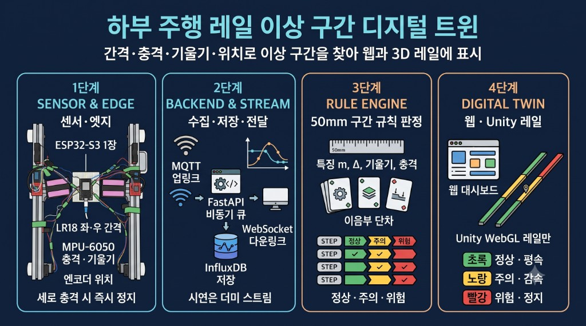

# 가변 계측–레일 이상 구간 디지털 트윈 기반 갠트리 크레인 안전관리 시스템

## 프로젝트 소개

본 프로젝트는 대형 갠트리 크레인이 **하부 주행 레일**을 따라 이동할 때 생기는 간격·충격·기울기·위치 데이터로, 이음부 단차·수직 변형·좌우 높이차를 구분해 웹 대시보드와 Unity WebGL에 표시하는 디지털 트윈입니다. 정상·주의·위험에 따라 평속·감속·정지를 정합니다. RBF는 쓰지 않습니다.

> **핵심 타겟:** 센서가 기록하는 이름은 **수직 변형**을 포함한 레일 기하입니다. 거더 변형·기초 침하·받침 열화는 그 원인입니다.

## 팀원 및 담당 역할

* **배용진:** SENSOR & EDGE (센서 데이터 획득, 교정, 축 정의)
* **배준호:** BACKEND & RULE ENGINE (비동기 수집, 4분류 규칙 판정)
* **김병서:** WEB & UNITY WEBGL (대시보드, 레일 3D)
* **김정우:** 조립·시험 (축소 모형, 반복 주행)

## 사용 하드웨어 및 기술 스택

* **현재 하드웨어 (Edge):** ESP32-S3-DevKitC-1 N16R8 1장. 좌·우 각 LR18-08U, MPU-6050, ADS1115, L298N, JGB37-520. 상세는 [`docs/hardware-configuration-history.md`](docs/hardware-configuration-history.md).
* **하드웨어 이력:** ESP32-C3 두 노드 펌웨어와 ESP32-S3-WROOM-1·ADXL345·HC-SR04 초기 스케치는 저장소에서 뺐다. 조립 실물에 올리는 코드는 `firmware/esp32_s3_rail_node/`이다.
* **백엔드 & 스트림:** Python, FastAPI, InfluxDB, ESP32 MQTT 업링크, 웹·Unity 다운링크 WebSocket.
* **판정:** 구간 특징 여섯 개로 이음부 단차·수직 변형·좌우 높이차. 웨이블릿·파고율·RBF는 쓰지 않음.
* **프론트엔드:** HTML/Vanilla JS, Tailwind CSS, Unity WebGL(레일만).

## 시스템 아키텍처 및 개발 로드맵

프로젝트는 총 4개의 Phase로 나뉩니다. 서버의 4분류 규칙 판정, InfluxDB 저장, 시연용 더미 스트리머와 웹·Unity 레일 뷰가 구현되어 있습니다. 조립 실물에 올리는 스케치는 `firmware/esp32_s3_rail_node/`이다.

### Phase 1: Sensor & Edge (실물 조립 완료)

* 실물 MCU는 ESP32-S3-DevKitC-1 1장이다. 좌·우 I2C 버스에 LR18-08U, MPU-6050, ADS1115를 각 1개 연결한다.
* `firmware/esp32_s3_rail_node/`는 가속도 3축, 자이로 3축, 칩 온도, 간격, 엔코더를 읽는다. 주행 중일 때만 MQTT 배치를 보낸다. BOOT는 전진 25초 후 정지한다.
* ESP32-S3-WROOM-1·ADXL345·HC-SR04 초기 스케치는 저장소에서 뺐다. 현재 보드와 다른 구성이다.

### Phase 2: Backend & Real-Time Data Stream (프로토타입 완료, 고도화 예정)

* **센서 업링크:** Wi-Fi MQTT QoS 1 → NCP Mosquitto → FastAPI 구독 → 비동기 Queue. 배치는 주행 중일 때만 온다.
* **분석 다운링크:** FastAPI → `/ws` → 웹 대시보드 / Unity WebGL.
* **시연:** `DEMO_MODE=true`일 때 1m 더미 레일의 20~25cm, 45~70cm, 80~90cm에 세 결함을 넣는다. 화면에는 시뮬레이션이라고 표시한다.

### Phase 3: Rule-Based Zone Detection (진행 중)

* 원시 간격을 구간 특징 `m`, `Δ`, `dm/dx`, `dΔ/dx`, `apeak`, `φ`로 만들어 `defects[]`와 단계 색 `rail_risk`를 낸다.
* 주의는 감속, 위험은 진입 전 정지. 정지 명령은 MQTT `.../command`이고, ESP32는 세로 충격만으로도 멈춘다.
* PyTorch RBF·`PRED_RAIL_DEFORM`·파고율은 목표 스택에서 제외.

### Phase 4: Web Dashboard & Unity Rails (진행 중)

* WebSocket 연동 실시간 웹 대시보드.
* Unity WebGL에 **레일만** 띄운다. 각 줄은 25×25 mm, 60 cm 아연 각파이프 3개를 이은 180 cm이다. 이상 구간 색과 갠트리 위치를 같은 좌표로 표시한다. 크레인 메시는 넣지 않는다.

## 프로토타입 실행 방법 (Getting Started)

1. **펌웨어:** `firmware/esp32_s3_rail_node/`에서 `secrets.h.example`을 `secrets.h`로 복사하고 와이파이와 MQTT 비밀번호를 넣는다. `secrets.h`는 커밋하지 않는다. 보드 ESP32S3 Dev Module, USB CDC로 업로드한다.
2. **환경 설정:** `.env.example`을 `.env`로 복사합니다. 실물 입력은 `DEMO_MODE=false`, 시연은 `DEMO_MODE=true`입니다.
3. **백엔드 가동:** `uvicorn main:app --host 0.0.0.0 --port 8000`
4. **센서/화면 접속:** ESP32는 `mqtt://223.130.128.198:1883`, 웹 대시보드는 `https://223.130.128.198:8000/dashboard` (`/ws`로 Unity·표가 같은 데이터를 받습니다).
5. **Unity WebGL (선택):** Mac 온보딩은 [`docs/mac-m5-unity-onboarding.md`](docs/mac-m5-unity-onboarding.md)입니다. 빌드는 `unity/RailTwinRails/README.md`대로 한 뒤 `scripts/sync_unity_webgl.sh`로 `frontend/unity/Build`에 복사합니다. 빌드 전에는 대시보드가 브라우저 레일 뷰를 씁니다.

## 개발보고서 및 AI 인계

* **ESP32 MQTT 계약:** [`docs/esp32-mqtt-contract.md`](docs/esp32-mqtt-contract.md)
* **공식 PDF 양식 항목표:** [`docs/development-report-template-map.md`](docs/development-report-template-map.md)
* **프로젝트 통합 문맥:** [`docs/notion-project-context.md`](docs/notion-project-context.md)
* **센서 하드웨어 변경 이력:** [`docs/hardware-configuration-history.md`](docs/hardware-configuration-history.md)
* **Cursor·ChatGPT 인계 프롬프트:** [`docs/development-report-ai-handoff.md`](docs/development-report-ai-handoff.md)
